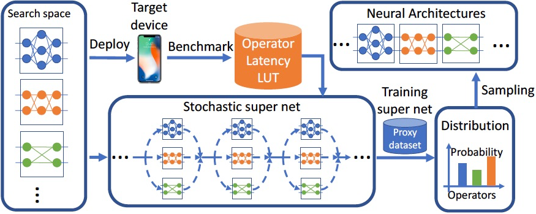

# Low-Overhead Latency Predictor
***!!!The following readme file contains only a small sample of preliminary experiments and research results. Detailed explanations and results of our experiments will be published at an IEEE conference early next year!!!***

We found that prediction models based on a combination of activations, FLOPs, and input sizes provide accurate prediction of latency and require little time to learn. They are easy to use, and take runtime implementations into account. Based on these findings, we developed a **latency predictor based on low-overhead profiling using micro-benchmarks** to minimize the performance modeling overhead.

---
## Underlying idea
We found that the latency of a block within a convolutional neural network is determined by the summed up input sizes, output sizes and the computational effort of all occurring convolutional operations. In other words, the **latency of a block is defined by the time to fetch the input, the time to write the output and the computation time** of the containing convolutional operations. The **influence of each term has to be learned by means of training data**.
This leads us to our developed linear formula for runtime prediction of blocks in convolutional neural networks:

$$LATENCY = a * ACTS + b * INP + c * FLOPs + d$$

*ACTS: Number of activations* </br>
*INP: Size of input tensors* </br>
*FLOPs: Number of floating point operations* </br>

The parameters a, b, c and d are used to weight the individual factors activations, input size and floating point operations specific to the hardware. In this way we are able to identify whether a hardware is memory bound (strong weighting on input size and activations) or computional bound (stronger weighting on FLOPs).

To learn the hardware specific factors a, b, c and d, our micro benchmark tool collects 100 data points by running a predefined set of blocks on the target device and gathering all the necessary data. Using machine learning methods, our algorithm learns two regression models. 

We find that our model provides accurate predictions especially in the high latency region. In the low latency range, there is more variance, because at low utilization of the computational units, small interferences have a larger relative effect on the runtime. For this reason, we learn a total of two regression models, one for the low latency range and one for the high latency range.
The low-latency regression model is defined by a fitted slope, offset, and breakpoint applied to the initial prediction (which comes from the high-latency model).

Once the prediction model has been trained, predictions can be made by performing the following calculation:

**initial prediction = a \* ACTS + b \* INP + c \* FLOPs + d </br>**
**Holds initial prediction < breakpoint?**
* Yes: **predicted latency = latency * initial prediction = offset**
* No: **predicted latency = initial prediction**


---
## Possible Use Cases

### Bottleneck Analysis & Optimization
Since our latency predictor can predict the runtime of individual blocks in convolutional neural networks, it serves very well for **bottleneck analysis**. Using our latency predictor, individual blocks with high latencies can be identified and optimized.
<p align = "center">

</p>

### Designing Latency Optimized CNN
Once our Latency Predictor is trained on a target device, it can make predictions about the latency of a CNN independently of the target device. This makes it especially useful for the automated design of CNN architectures.

The following diagram shows the FBNet NAS framework, which is used to find latency-efficient design architectures of artificial neural networks.
In experiments, we succeeded in replacing the target device with our latency predictor. This way the runtimes of single blocks can be predicted and do not have to be executed and benchmarked individually on the target device. 


<p align = "center">
 </br>
Source: https://nni.readthedocs.io/en/v2.3/NAS/FBNet.html
</p>


---
## How to use

### Python-Fire:
If the dnn exists as a script, it is possible to run the dnn analyzer via pytorch-fire:
```bash
$ python runner.py --file=example_net.py --model=ExampleNetV2 --input=[3, 224, 224] --batch=1
```
Specifying values for input and batch size is optional. Default is input=[3, 224, 224], batch=1.

### Running the analyzer by importing it as a module
* Download the the DNN analyzer and unzip the folder
* The calling file must import the model_analysis file as below
* Start the analysis process by creating a new instance of ModelAnalyse passing the model to analyze, the input shape and batch size:
  model_analysis.ModelAnalyse(model, ([CHANNELS], [HEIGHT], [WIDTH]), [BATCH_SIZE])

---
## Example
In the following example we learn a latency predictor for the Nvidia A100 80GB GPU.<br />

Initially, our model collects a training data set by running our developed micro benchmarking tool.<br />
By using machine learning methods, our algorithm automatically trains regression models based on the collected micro training dataset.

<p align = "center">

</p>

This graph shows the two learned regression models and the training set used. 
<p align = "center">

</p>

The following graph shows the performance of the learned latency prediction model for the Nvidia A100 80GB GPU.<br /> 
Each point represents a sample from the collected test data set, which contains a total of over 17000 data points. The yellow line indicates the predicted latencies.

<p align = "center">

</p>

Our prediction model for the Nvidia A100 GPU achieves **low median relative errors** of 
* **20.87%** in the low latency range (<2ms) 
* **9.46%** in the high latency range (>2ms)

as well as a high **correlation of 0.98** between the actual and the predicted latency and a **R-squared value of 0.96**.

---
## Authors

* [Jakob Michel Stock](https://github.com/Jeykobz) Student research assistant at the laboratory for Parallel Programming at TU Darmstadt
* [Arya Mazaheri](https://github.com/aryamazaheri) Research associate at the laboratory for Parallel Programming at TU Darmstadt
* [Tim Beringer](https://github.com/tiberi) Research associate at the laboratory for Parallel Programming at TU Darmstadt

---
## References

We have studied many different existing neural network analyzers to understand and benefit from their approaches.

Thanks to [@Swall0w](https://github.com/Swall0w) and [@sovrasov](https://github.com/sovrasov) who already implemented and published neural network analyzers.

* [flops-counter-pytorch](https://github.com/sovrasov/flops-counter.pytorch) -> we benefited from the initial version of the calculation of the computational requirements 
* [torchstat](https://github.com/Swall0w/torchstat) -> we took advantage of the initial version of the memory usage calculation and the approach of modifying the calling functions of the layers to be able to analyze them during inference

Other work from which we benefited:
* [How fast is my model?](https://machinethink.net/blog/how-fast-is-my-model/) -> blog post about predicting computational requirements of neural networks
* [Neural-Network-Analyser](https://github.com/rohitramana/Neural-Network-Analyser) -> neural network analyzer by [@rohitramana](https://github.com/rohitramana)
